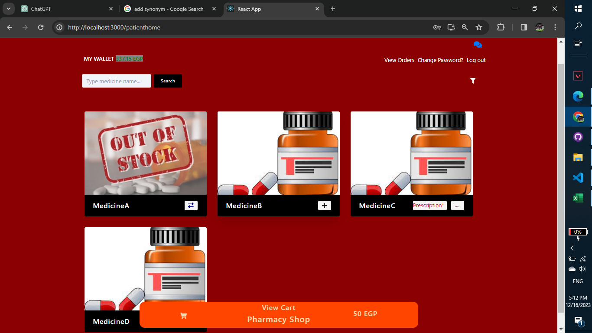
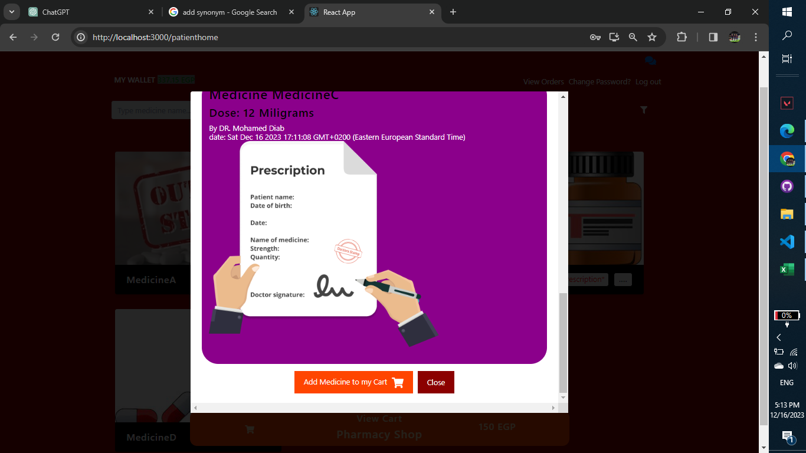
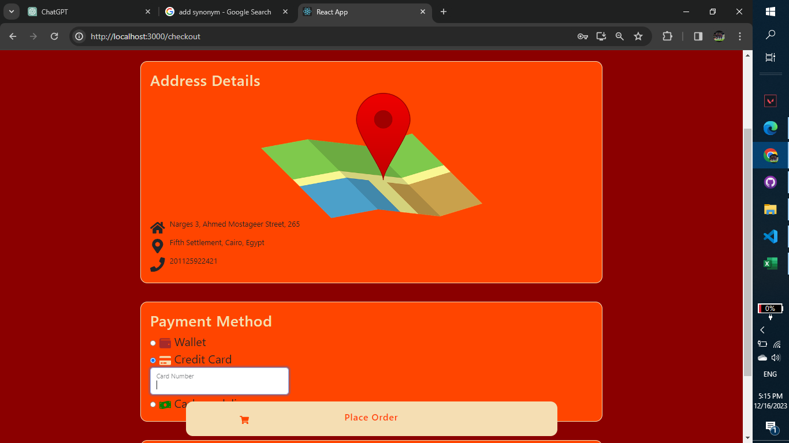
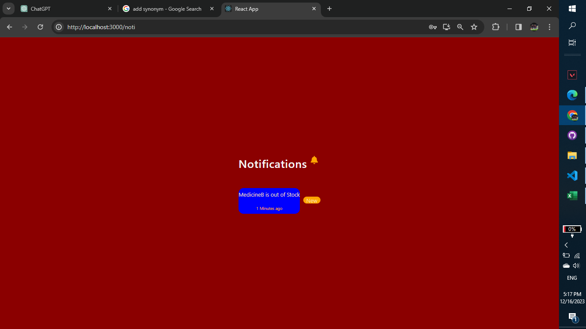
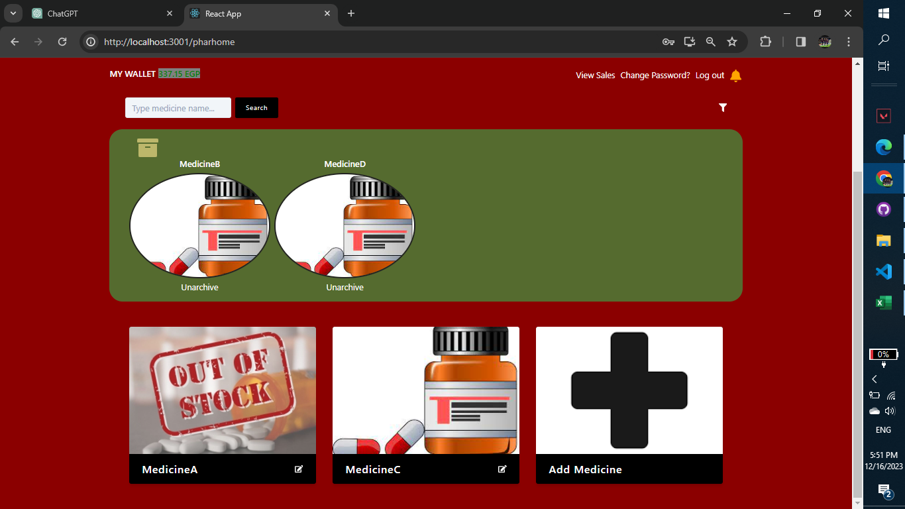
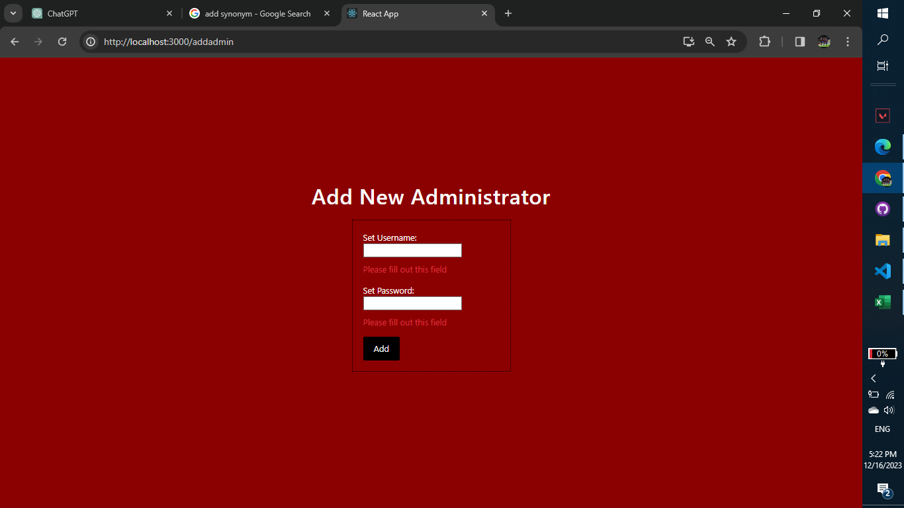
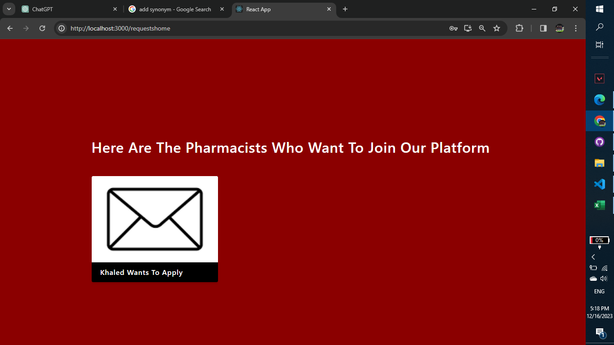
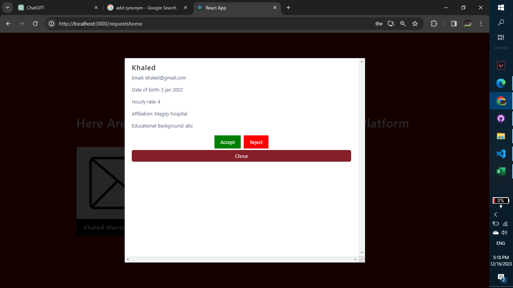

# Topp Pharmacy

# Project Title

El7a2ny: Virtual Pharmacy

## Motivation

El7a2ny Virtual Pharmacy is a software solution for admins, pharmacists and patients trying to interact
and fulfill each other's needs on stream. This includes patients buying medicines, communicate with pharmacists and take pieces of advice from them..etc, and includes pharmacists adding / changing medicines...etc, just like in real life.

## Build Status

* The project is currently in development
* The project needs more thorough testing

## Code Style

Describe the coding style you're following (e.g., linting rules).

## Screenshots

A Patient adding medicines to his Cart.

A Patient choosing a related prescription to be able to add medicineC to his Cart.

A Patient is at the checkout stage where he chooses the payment method, address...

A Pharmacist view of all medicines and has the option to add a new One.

A Pharmacist getting notified that medicineB is out of stock.

A Pharmacist decides to archive MedicineB & MedicineD.

An Admin adding a new Admin to the system.

An Admin seeing the requests of the guests applying as Pharmacists.

An Admin choosing whether to accept or reject the request.

## Tech/Framework used

MERN stack
* Mongo db (NoSQL db) for holding the database for medicines, patients....All the Entities
* Express.js framework for the Back-end
* React.js library for the Front-end (No framework used in Front-end)
* Node.js as a runtime environment (Not Vanilla JS)
Installed with Npm, Npx where all libraries are installed from there

## Features

We have 3 users in our Pharmacy (guest excluded) :
1. Admin
An Admin can view the uploaded documents of a new requested pharmacist and decide whether to hire him or not. In addition to viewing the requests of pharmacists to join the platform, administrator is also capable of viewing the basic information related to anyone on the system and decide to add/remove patients or pharmacists from the system or not. Furthermore, an admin can add new admins to the system, and has the right to check the total sales report of the pharmacy.

2. Pharmacist
A Pharmacist has the right to view all the medicines on the system with some details only a pharmacist can see like the available quantity left and the sales per medicine. Moreover, a hired pharmacist can edit medicine description, price, picture and archive whatever medicine he wants from the system (so a patient can not see it) as well as communicating with patients and doctors through chat or video calls.

3. Patient
A Patient is able to view the medicines available in the pharmacy (unarchived by the pharmacist) and add these medicines to the cart, choose the amount needed per medicine (as long as the quantity is valid), and add prescription medicines to his cart as well, but a related medicine prescription has to be attached to complete the process and the medicine gets added to the cart, and at the end the patient is able to place the order, and if he changes his mind due to any reason, he has the opportunity to cancel the order. In addition, a patient can choose to pay via credit card, cod or his account wallet, and also able to edit or add a new delivery address on the platform.

For a Guest :
A guest can request to join the platform as a pharmacist through registration and uploading the required doucuments. In case he got accepted (by the administrator), now he is officially a pharmacist on the system.
Moreover, a guest can join the platform as a patient through registration only, no documents to upload, just filling the registration form (name, enmaol, date of birth,...etc) and in case an admin accepts,
now that guest is considered a patient on the system.

## Code Examples

## Installation

1. Clone the repository.
2. Install dependencies.

## API References

If applicable, provide references to your API documentation.

## Tests

Explain how to run tests and provide any relevant information about testing.

## How to Use

Provide instructions on how to use your project.

## Contribute

Explain how others can contribute to your project.

## Credits

Give credit to those who contributed to the project or inspired you.

## License

Specify the license under which your project is distributed.
